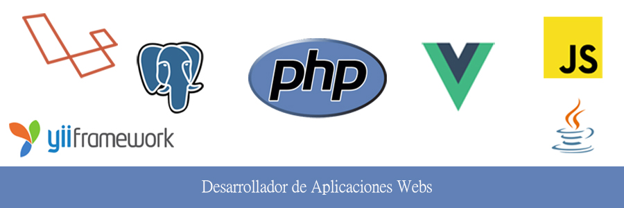

# 

### Sobre mí

Soy desarrollador de aplicaciones web, apasionado por las
nuevas tecnologias, me considero responsable, activo,
abierto al aprendizaje y puntual.
Me adapto a condiciones de presión así como resolver
problemas eficientemente y lograr los objetivos propuestos
por la empresa.

Actualmente trabajo de backend con el framework laravel. 

[gmail_logo]: https://user-images.githubusercontent.com/6497827/62424751-c1b85480-b6f0-11e9-97de-096c0a980829.png
[telegram_logo]: https://user-images.githubusercontent.com/6497827/57844175-2ac4b600-77ed-11e9-8488-f2d45efa7497.png
[telegram]: http://t.me/jujerez
[gmail]: mailto:juanantonio.jerezr@gmail.com?subject=Leyendo%20#jujerez&body=Hi

## Contacto
[![Contact me on telegram][telegram_logo]][telegram]
[![Mail me][gmail_logo]][gmail]

<!-- ### Mis cursos

A pesar de mis conocimientos y que tengo poco tiempo libre sigo formandome con cursos:

* Curso Frontend developers profesional <small>Duración: 200h</small> -->

